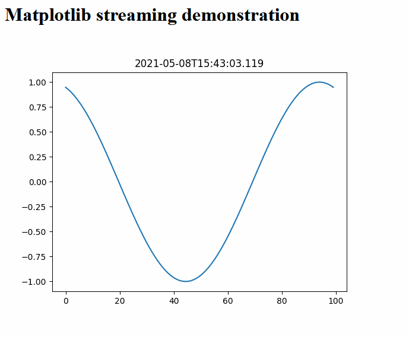

# Matplotlib streaming via [RabbitMQ](https://www.rabbitmq.com/)



Run it like this:

```shell
# shell 1
docker run -it --rm --name rabbitmq -p 5672:5672 -p 15672:15672 rabbitmq:3-management
# RabbitMQ admin interface will be available on http://localhost:15672/ (login: guest/guest)

# shell 2
python3 producer.py hello_world png

# shell 3
flask run
```

Then navigate to whatever URL is displayed by Flask.

In practice, Matplotlib seems to be able to keep up to about 10 FPS.

Adapted from https://medium.datadriveninvestor.com/video-streaming-using-flask-and-opencv-c464bf8473d6
